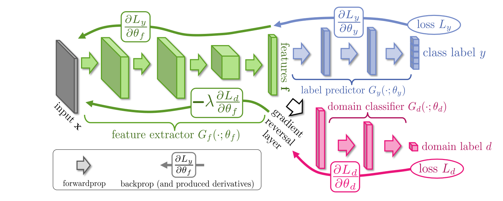

# Domain Adaptation

## [Unsupervised Domain Adaptation by Backpropagation](http://arxiv.org/abs/1409.7495)

### 1 Contributions

1. a generic method for domain adaptation that can add to any model that use BP.
2. the beginning of DA by adversarial  learning

### 2 Motivation

1. For model trained by synthetic data, it suffer from the *shift* in data distribution.(Generally we say the data come from different domain)

    > Learning a discriminative classifier or other predictor in the presence of a shift between training and test distributions is known as domain adaptation (DA)

### 3 Architecture

1. Assumption: *covariate shift assumption*

2. 

3. how to train it?

    $\begin{aligned}
    &\theta_f \quad \longleftarrow \quad \theta_f-\mu\left(\frac{\partial L_y^i}{\partial \theta_f}-\lambda \frac{\partial L_d^i}{\partial \theta_f}\right) \\
    &\theta_y \quad \longleftarrow \quad \theta_y-\mu \frac{\partial L_y^i}{\partial \theta_y} \\
    &\theta_d \quad \longleftarrow \quad \theta_d-\mu \frac{\partial L_d^i}{\partial \theta_d}
    \end{aligned}$

    -> gradient reversal layer

### 4 Discussion

1. further evaluation on larger-scale tasks and semi-supervised settings
2. how to get a good initialization of the feature extractor
